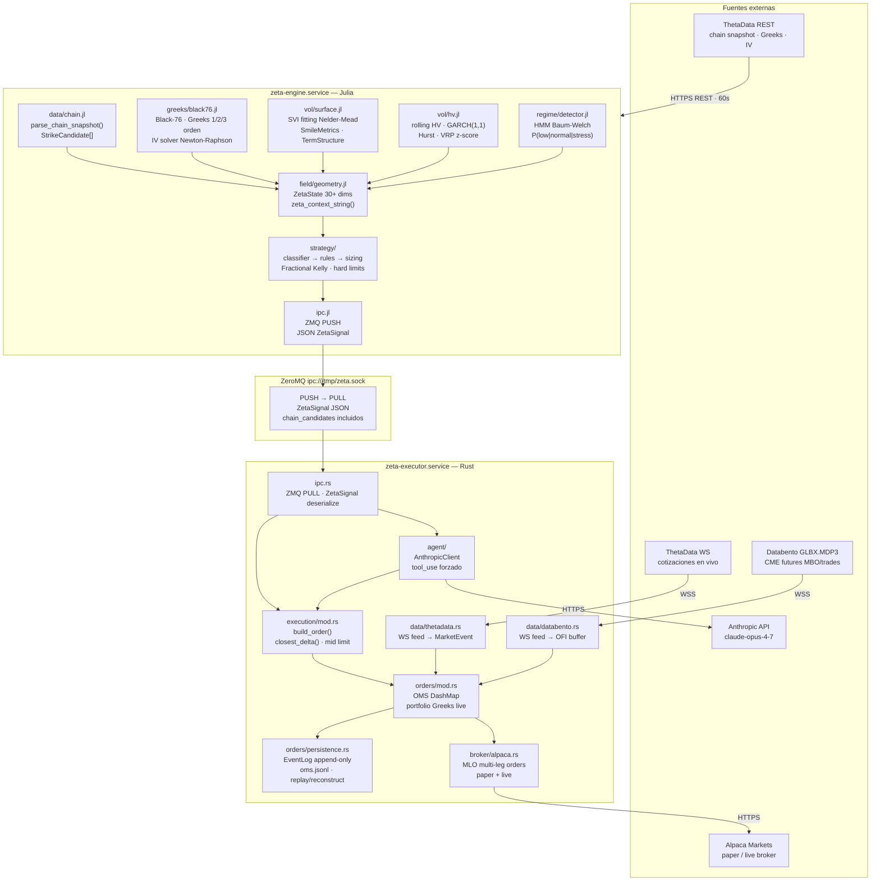
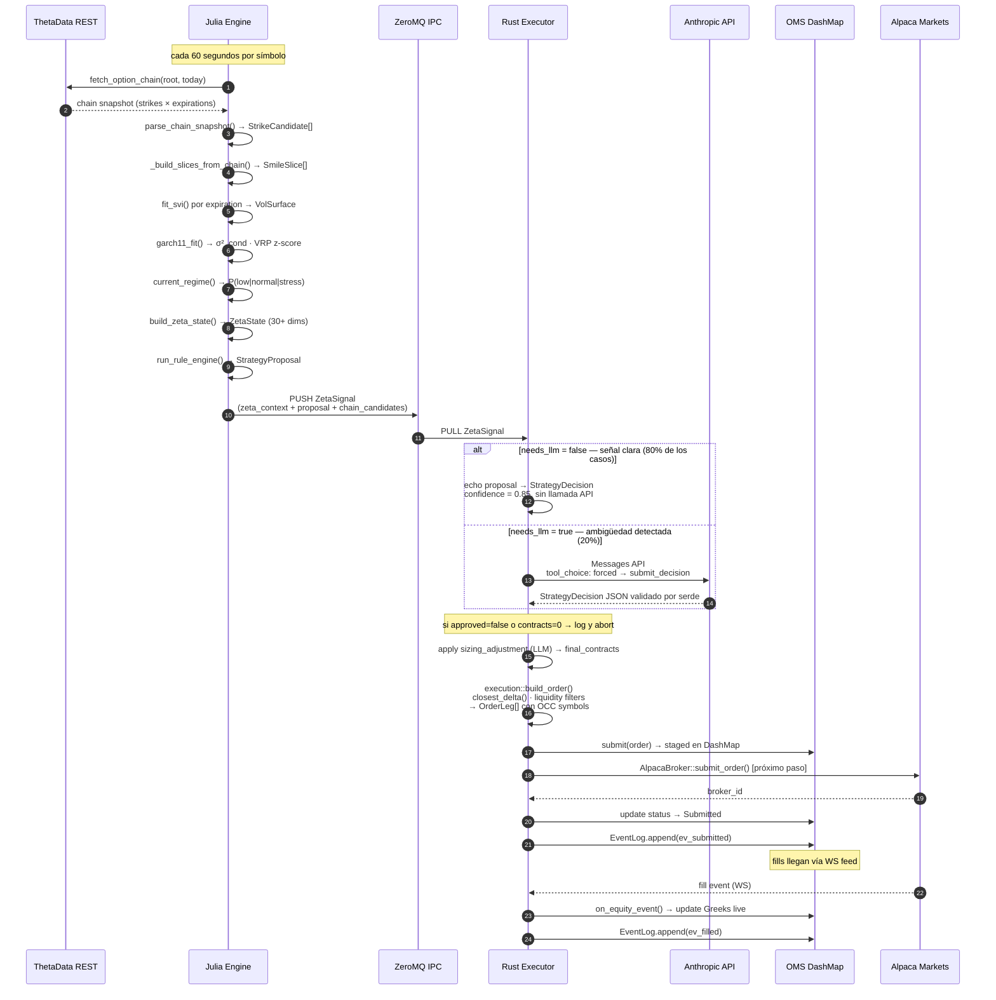
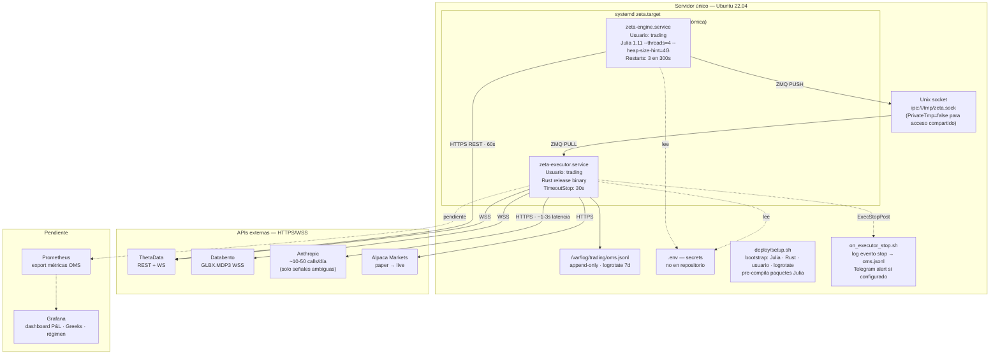
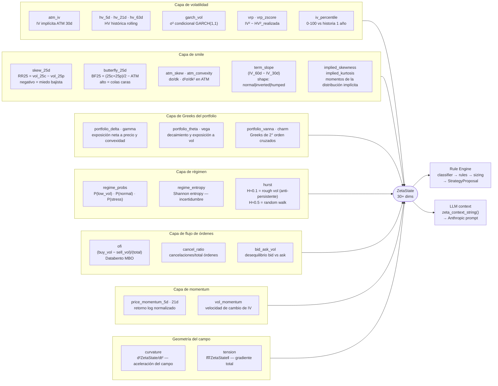
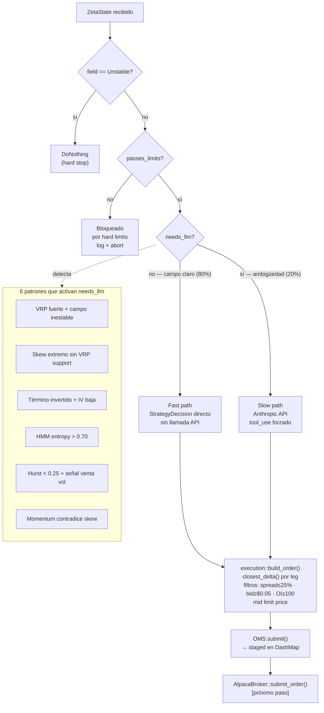

# Sistema — Arquitectura y Flujo de Datos

## 1. Componentes del sistema

---

## 2. Flujo completo de una señal

---

## 3. Infraestructura de despliegue

---

## 4. ZetaState — anatomía del campo (30+ dimensiones)

---

## 5. Árbol de decisión del rule engine

